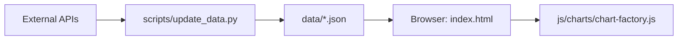

# GEMINI.md - Macro Dashboard Instructions

This document provides specialized context and guidelines for developing and maintaining the Macro Dashboard project.

## Project Overview
A "serverless" macro-economic indicator dashboard that visualizes global financial and economic data. It operates by fetching pre-processed JSON files from a local `data/` directory, ensuring high performance and eliminating the need for a live backend during browser execution.

- **Frontend:** Vanilla JavaScript, CSS, HTML, Apache ECharts.
- **Data Layer:** Static JSON files generated by a Python worker script.
- **Data Sources:** FRED (Federal Reserve Economic Data), Yahoo Finance, CNN, FINRA, and Shiller/Yale.

## Architecture & Data Flow

- **Static First:** The browser *never* makes direct calls to external financial APIs. This prevents CORS issues and API key exposure.
- **State Management:** Handled by the `MacroDashboard` class in `js/app.js`, managing chart instances, normalization modes (Raw, Z-Score, % Change), and date ranges.

## Development & Execution

### Running Locally
- **Simple Server:** Use `start.bat` or `python -m http.server 8080`.
- **Direct Access:** Since it fetches local files, a local server is required to bypass browser security restrictions on `fetch()` calls to `file://` URIs.

### Updating Data
- **Full Update:** Run `update.bat YOUR_FRED_API_KEY`.
- **Selective Update:** Use `python scripts/update_data.py` with flags like `--market`, `--forex`, or `--fred`.
- **Automation:** GitHub Actions (`.github/workflows/update-data.yml`) handles hourly updates for the live site.

## Key Files & Directories
- `js/charts/chart-configs.js`: **Critical.** Defines all chart metadata, series, units, and interpretation text. Edit this to add or modify charts.
- `scripts/update_data.py`: Contains the logic for fetching and converting data from various providers.
- `js/app.js`: The application entry point and orchestrator.
- `data/`: Contains the cached macro data. **Do not edit manually**; use the update script.

## Coding Conventions
- **No Bundler:** The project uses plain script tags. Maintain the order defined in `index.html` and `CLAUDE.md`.
- **Global Scope:** Modules are exposed as globals (e.g., `CONFIG`, `ChartFactory`, `app`). Use descriptive names to avoid collisions.
- **Chart Definitions:** When adding a new chart, ensure it has a unique `id` and appropriate `category` as defined in `js/config.js`.
- **Units & Formatting:** Use `koUnit: true` in chart configs for Korean-style number formatting (만/억) where applicable.

## Common Tasks

### Adding a New Indicator
1. **Fetch Data:** Update `scripts/update_data.py` to fetch the new series and save it to `data/`.
2. **Configure Chart:** Add a new entry to `CHART_CONFIGS` in `js/charts/chart-configs.js`.
3. **Map Source:** If using FRED, add the mapping in `js/fred-api.js` (`FredAPI._staticName`).
4. **UI Filter:** If adding a new category, update both `js/config.js` and the filter buttons in `index.html`.

### Refining Visuals
- Chart styling is primarily handled via ECharts options in `js/charts/chart-factory.js`.
- Layout and card styling are in `css/style.css`.

## Troubleshooting
- **Missing Data:** Check if the corresponding `.json` file exists in `data/`. If not, run the `update_data.py` script for that category.
- **Fetch Errors:** Ensure the local server is running.
- **FRED API Errors:** Verify your `FRED_API_KEY` environment variable or command-line argument.
