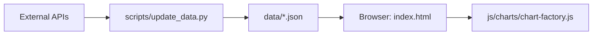

# Macro Dashboard (거시경제 지표 대시보드)

전 세계 거시경제 및 금융 지표를 시각화하는 "서버리스" 정적 대시보드입니다. FRED, Yahoo Finance, CNN, FINRA 등 다양한 소스에서 데이터를 수집하여 로컬 JSON 파일로 캐싱하며, 브라우저에서는 별도의 백엔드 없이 정적 파일만으로 동작합니다.

**라이브 데모:** [https://jongh0.github.io/macro-dashboard/](https://jongh0.github.io/macro-dashboard/)

---

## 🏗 아키텍처 및 데이터 흐름

이 프로젝트는 **Static-First** 원칙을 따릅니다. 브라우저는 외부 API를 직접 호출하지 않고, 미리 생성된 JSON 데이터를 읽어옵니다. 이를 통해 CORS 문제와 API 키 노출을 방지하며 빠른 로딩 속도를 보장합니다.



1.  **데이터 수집 (Python):** `update_data.py` 스크립트가 외부 API에서 최신 데이터를 가져와 `data/` 폴더에 표준화된 JSON 형식으로 저장합니다.
2.  **정적 호스팅:** `index.html` 및 관련 JS/CSS 파일이 `data/` 폴더의 JSON을 fetch하여 화면에 렌더링합니다.
3.  **자동화:** GitHub Actions가 매시간 데이터를 업데이트하여 라이브 사이트를 최신 상태로 유지합니다.

---

## ✨ 주요 기능

-   **데이터 정규화 (Normalization):**
    -   **Raw:** 실제 수치 표시 (이중 Y축 지원)
    -   **Z-Score:** 평균 대비 표준편차로 변환하여 서로 다른 단위의 지표를 직접 비교
    -   **% 변화:** 기준 시점 대비 변동률 (%) 표시
-   **스마트 포맷팅:** 한국 사용자 편의를 위한 '만/억' 단위 표기 (`koUnit`) 및 퍼센트/정수 자동 최적화.
-   **상태 지표 (Status Indicators):** MDD(최대 낙폭) 분석 및 임계값(Threshold) 기반의 상태 표시 (예: 탐욕/공포 단계).
-   **반응형 차트:** Apache ECharts 기반의 고성능 인터랙티브 차트.
-   **오프라인 친화적:** 데이터를 한 번 로드하면 브라우저 메모리에 캐싱되어 탐색이 매우 빠릅니다.

---

## 🚀 빠른 시작

로컬에서 대시보드를 실행하려면 `fetch()` API 보안 제약으로 인해 로컬 서버가 필요합니다.

**Windows:**
```bat
start.bat          # 로컬 서버 실행 (http://localhost:8080)
```

**Python (직접 실행):**
```bash
python -m http.server 8080
```

---

## 🔄 데이터 업데이트

데이터를 직접 업데이트하려면 FRED API 키가 필요할 수 있습니다. ([발급 받기](https://fred.stlouisfed.org/docs/api/api_key.html))

### 1. 의존성 설치
```bash
pip install requests pandas openpyxl yfinance xlrd pytrends
```

### 2. 업데이트 실행
**배치 파일 사용 (Windows):**
```bat
update.bat YOUR_FRED_API_KEY
```

**Python 스크립트 직접 사용:**
```bash
# 전체 업데이트
python scripts/update_data.py --all --key YOUR_FRED_API_KEY

# 카테고리별 선택 업데이트
python scripts/update_data.py --market   # 주식, 원자재 (Yahoo Finance)
python scripts/update_data.py --fred     # 경제 지표 (FRED)
python scripts/update_data.py --fg       # 공포와 탐욕 지수
python scripts/update_data.py --fear     # 매크로 공포 트렌드 (Google Trends)
```

---

## 📂 프로젝트 구조

```text
macro-dashboard/
├── index.html              # 메인 페이지 및 UI 레이아웃
├── css/style.css           # 대시보드 스타일링
├── data/                   # 업데이트 스크립트로 생성된 정적 JSON 데이터
├── js/
│   ├── config.js           # 전역 설정, 카테고리 및 날짜 범위 정의
│   ├── app.js              # 애플리케이션 오케스트레이터 (MacroDashboard 클래스)
│   ├── cache.js            # 인메모리 TTL 캐시 로직
│   ├── normalizer.js       # Z-Score, % 변화 등 데이터 변환 모듈
│   ├── fred-api.js         # FRED 및 정적 데이터 로더
│   ├── cnn-api.js          # CNN Fear & Greed 데이터 로더
│   └── charts/
│       ├── chart-configs.js # 중요: 모든 차트의 메타데이터 및 설정 정의
│       └── chart-factory.js # ECharts 엔진을 통한 차트 생성 및 렌더링
├── scripts/
│   └── update_data.py      # 데이터 수집 및 가공 엔진 (Python)
└── .github/workflows/      # GitHub Actions 자동화 워크플로우
```

---

## 🛠 개발 가이드

### 새 차트 추가하기
1.  `js/charts/chart-configs.js`의 `CHART_CONFIGS` 배열에 설정을 추가합니다.
2.  데이터 소스가 FRED인 경우 `js/fred-api.js`의 `FredAPI._staticName`에 시리즈 ID 매핑을 추가합니다.
3.  필요한 경우 `scripts/update_data.py`에 수집 로직을 추가합니다.

### 새 카테고리 추가하기
1.  `js/config.js`의 `CATEGORIES` 객체에 새 카테고리를 정의합니다.
2.  `index.html`의 카테고리 필터 영역(`.category-filter`)에 해당 `data-cat` 값을 가진 `<button>`을 수동으로 추가합니다.

---

## 📊 데이터 출처

-   **Yahoo Finance:** 주가지수, 원자재, 환율 (실시간성 높음)
-   **FRED (St. Louis Fed):** 경제 지표, 금리, 통화량 등 (공식 통계)
-   **CNN Business:** Fear & Greed Index
-   **Alternative.me:** Crypto Fear & Greed Index
-   **FINRA:** Margin Debt 수치
-   **Robert Shiller (Yale):** CAPE Ratio 등 가치평가 지표

---

## ⚖️ 면책 조항 (Disclaimer)

본 대시보드에서 제공하는 모든 정보는 교육 및 참고용이며, **어떠한 경우에도 투자 조언(Investment Advice)이 아닙니다.** 데이터의 정확성을 보장하지 않으며, 투자 결정에 따른 모든 책임은 사용자 본인에게 있습니다.
